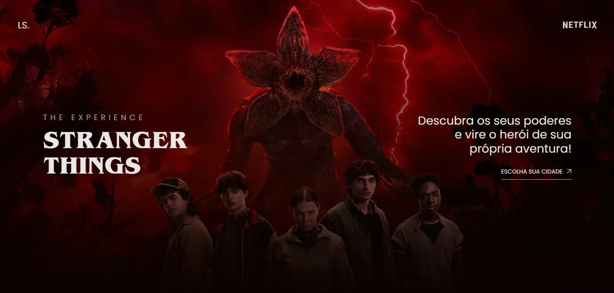

# Stranger Things — Landing Page



## Sobre o projeto

Projeto desenvolvido a partir de um desafio de aula, onde recebi o layout no Figma e recriei do meu jeito. A landing page tem temática de Stranger Things e foi construída com HTML, SASS e animações feitas com GSAP.

## Tecnologias

- HTML5
- SASS
- JavaScript
- [GSAP](https://gsap.com/) — animações

## Layout

O layout original foi disponibilizado via Figma durante a aula.

## Como rodar

Clone o repositório e abra o arquivo `index.html` no navegador:

```bash
git clone https://github.com/luisasouto/projeto_stranger_things.git
```

---

Desenvolvido por **Luisa**
